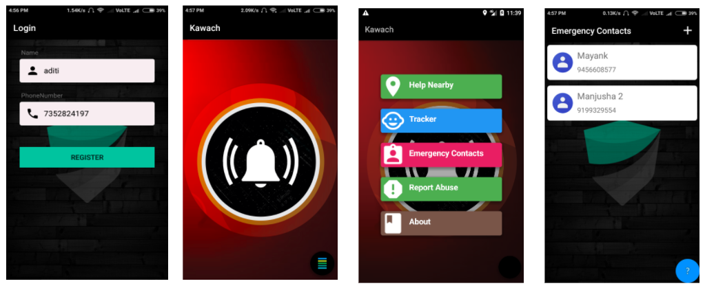

# Kawach
#### Developed for OpenGovDataHack Nationals 2017 

**The Problem**

According to Crime in India 2017 report by the National Crime Records Bureau, As many as 39 Crimes against women were reported Every Hour in India.
The same NCRB report also states that a child is abused Every Fifteen minutes in India.

**Our Solution : Kawach**

This app was developed to provide Safety and Security to app users and their loved ones on just one click of a button.

**What does Kawach do:**

* The core function of the app is to send the real time location of user. Location can be sent through sms or can be feeded to online database in real time from where it can further be fetched and displayed on other user's device.
* Kawach also provides a list of nearby hospitals, police stations, and fire stations on click of a button.
* It can also be used to report any crime you come across.

**Features**

* Sos button's background changes color according to risk level of the area you are in.
* User's emergency contacts will get distress message on click of a button.
* They can also track the users real time location at will.
* A list of nearby police stations, hospitals, and fire stations can be called up instantly when needed.
* App can also be used to report any crime user witnesses and the report can be passed to concerned authorities.

**Technologies used:**

* The app uses GPS for real time location. 
* It uses firebase to handle online database created. 

